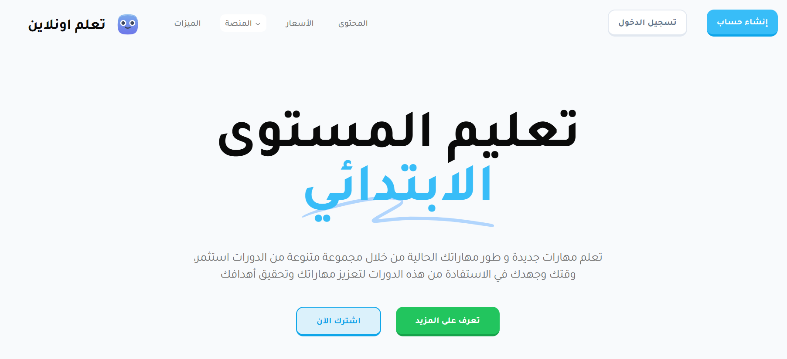
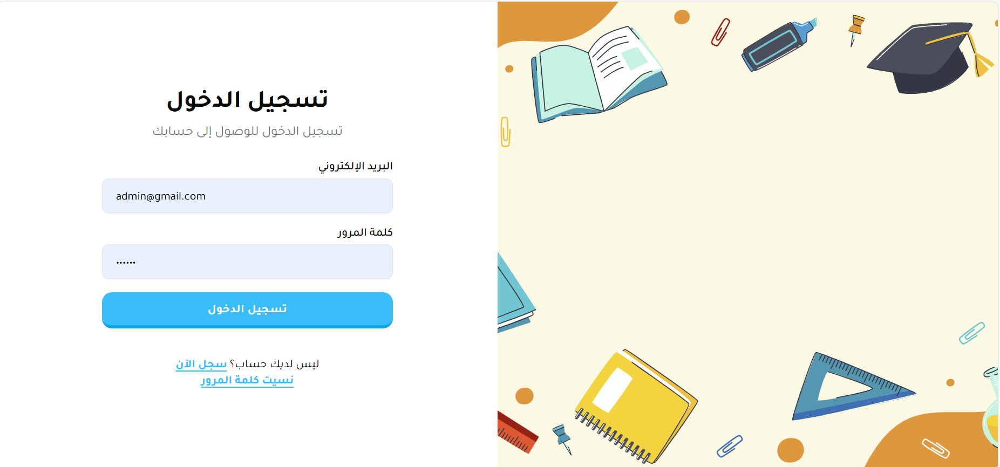
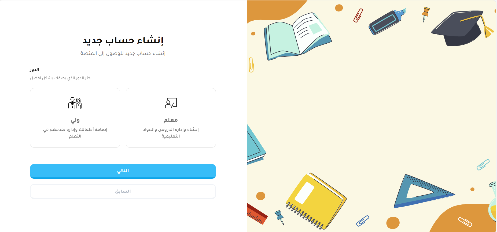
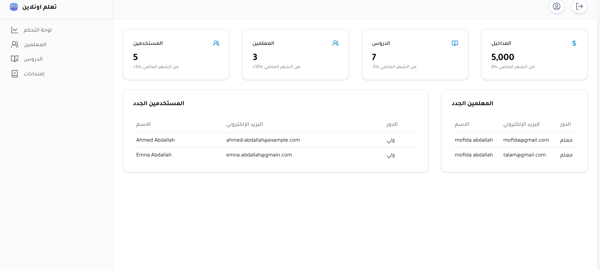
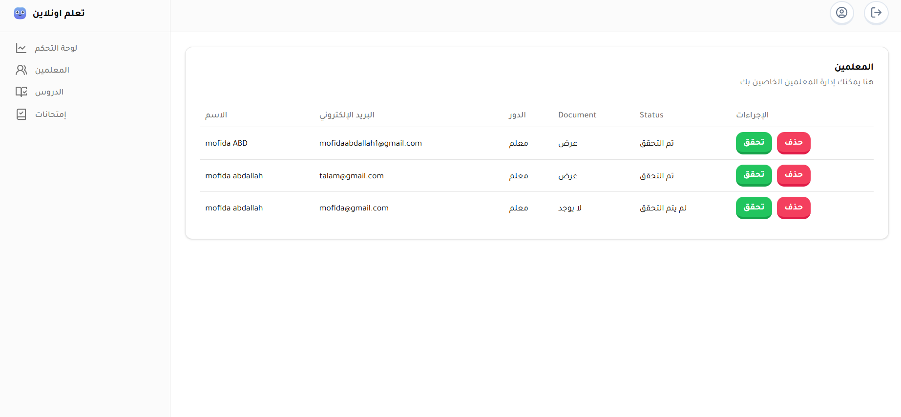
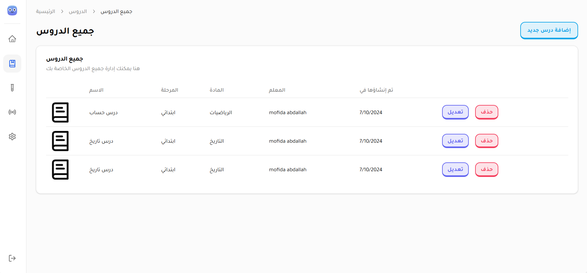
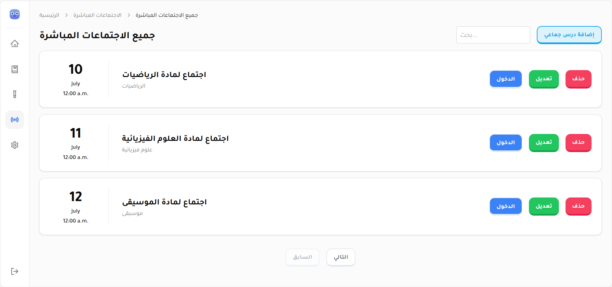
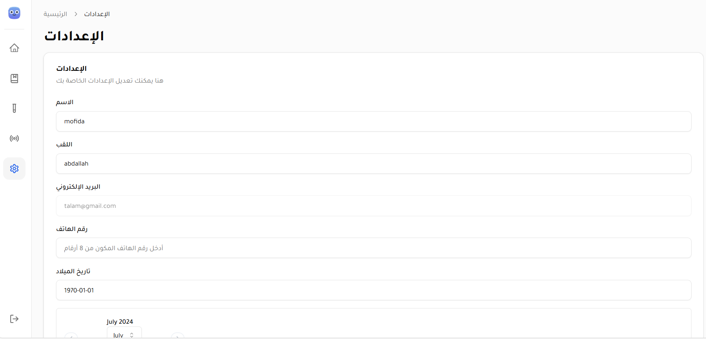
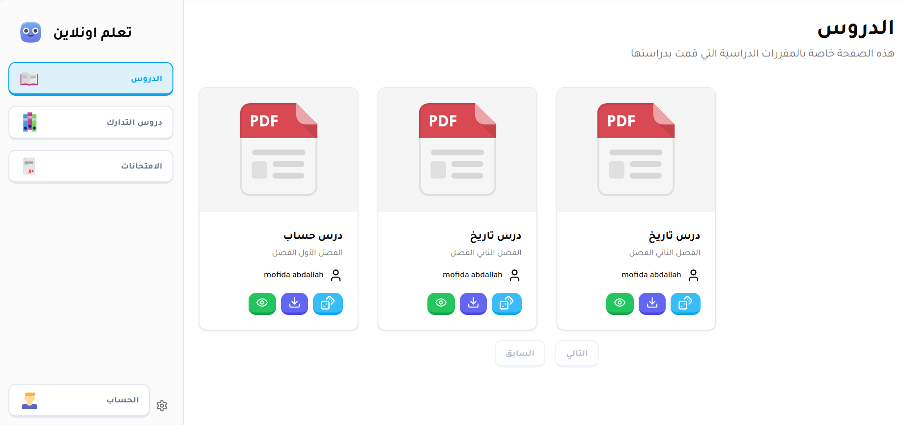
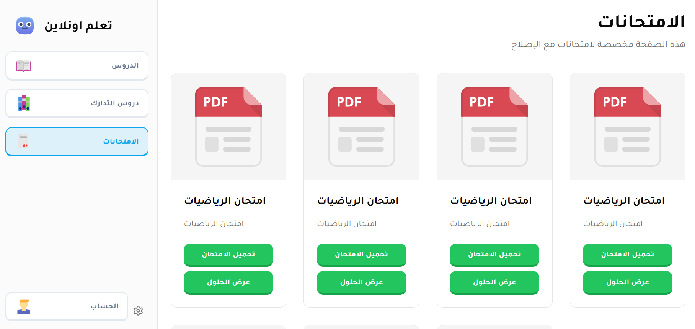

# E-Learning Platform

## Overview

A responsive e-learning platform developed with **Next.js** and **Spring Boot** using **Tailwind CSS**. The platform supports multiple user roles such as admin, teacher and parent. Parents can enroll their children and pay for live courses.
 

## Features
- **Responsive Design**: Adapted for various devices (desktops, tablets, smartphones).
- **Multi-user**: Different roles for admin, teacher, and parent.
  - **Admin**: Manage users, courses, and payments.
  - **Teacher**: Create and manage courses.
  - **Parent**: Enroll children, manage subscriptions, and pay for online courses.
- **Child Management**: Parents can enroll and manage their children's profiles.
- **Payments**: Payment system for online courses.

## Technologies Used
- **Front-end**: [Next.js](https://nextjs.org/), [Tailwind CSS](https://tailwindcss.com/)
- **Back-end**: [Spring Boot](https://spring.io/projects/spring-boot)

## Manual Setup

 <blockquote>
<p dir="auto">Make sure Docker is installed.</p>
</blockquote>

### Instructions
1. **Clone the repository:**
   ```bash
   git clone https://github.com/ranizouaoui/E-Learning-Platform
   cd E-Learning-Platform
   ```
2. **Build the Docker images and start the containers::**
   ```bash
    docker-compose up --build
   ```

3. **Build the Docker images and start the containers::**

- **Front-end:** Open your browser and go to http://localhost:3000
- **Back-end:** The Spring Boot API will be running at http://localhost:8080


## App preview

### Sign In


### Sign Up


### Admin Dashboard



### Teacher Dashboard




### Student Dashboard



## License

This project is licensed under the [MIT License](LICENSE).

 ## Want more details?
 
 For more details or if you want to recommend me for other projects. Just contact me on my email: <strong> ranizouaouicontact@gmail.com </strong>
